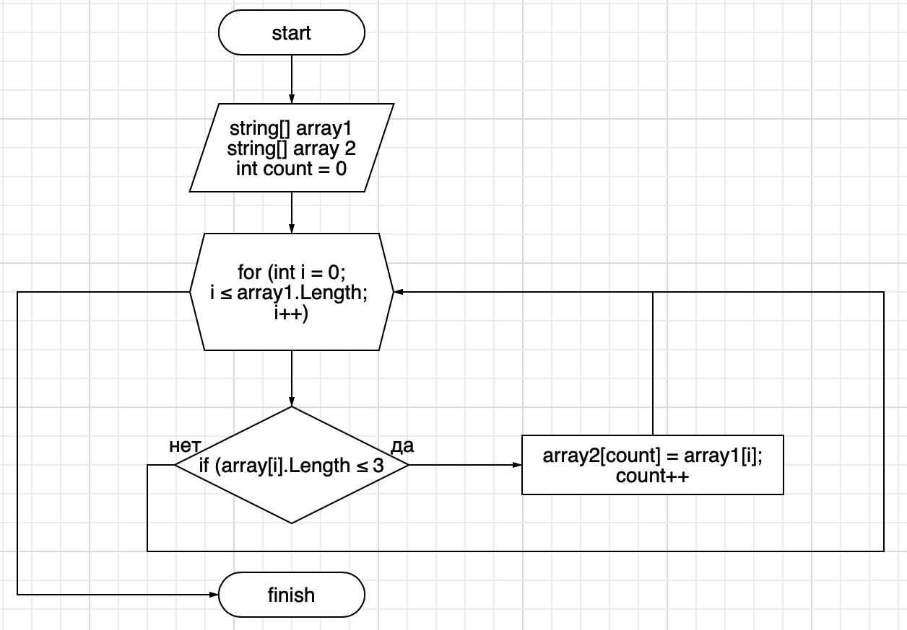

# Контрольная работа
## *Задание*:
Написать программу, которая из имеющего массива строк формирует массив из строк, длина которых меньше или равна 3 символам. Первоначальный массив можно ввести с клавиатуры либо задать на старте выполнения алгоритма. Прирешении не рекомендуется пользоваться коллекциями, лучше обойтись исключительно массивами.

## **Решение:**
1. Создать команду с возможностью ввода данных для массива.
2. Создать проверку на длину каждого элемента в массиве. Условие:
 - если длина элемента меньше или равна 3, то данный элемент выводится как результат;
 - если длина больше 3, то данный элемент не выводится в результате. 

